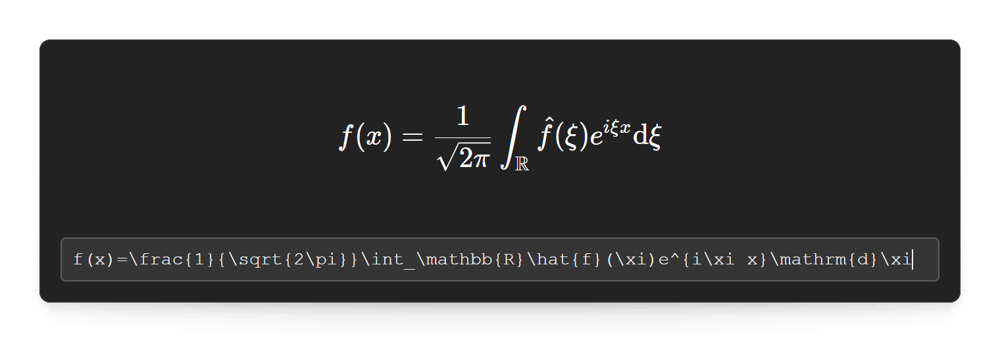

# TeXPaste
Input TeX code to get a live preview. Press ENTER or click the green checkmark to copy the result to the clipboard and use it in another application. ESCAPE or clicking the close button will discard the output.

Made with [Electron](https://www.electronjs.org/) and [KaTeX](https://katex.org/).

## Installation (Windows)
Download `texpaste-Setup-[version number].exe` from one of the [releases](https://github.com/jonasmusall/texpaste/releases) and execute it. You will probably get a warning that the program was not executed due to security concerns. This is because code signing is currently not available to me because the certificates are too expensive. However, you can use the SHA512 hash to verify the file.

Instead of using the installer you can download and extract `texpaste-unpacked-[version number].zip` and execute the application (`texpaste.exe`) directly from this folder as a portable alternative to installing it.

## Installation (other platforms)
Downloads for Linux are being worked on. If you are using macOS, you will have to build the app for yourself as described below.

## Development
To build or run this app directly from the source code, you will need [Node.js](https://nodejs.org/). Clone or download the repository and use the following commands.

| Command        | Description                                                        |
| -------------- | ------------------------------------------------------------------ |
| `npm install`  | Installs the required dependencies.                                |
| `npm start`    | Launches the application.                                          |
| `npm run pack` | Packages the application (output is located in the "dist" folder). |
| `npm run dist` | Packages while also creating an installer.                         |

## Upcoming features
Custom TeX macros, possibly an autocomplete feature.
