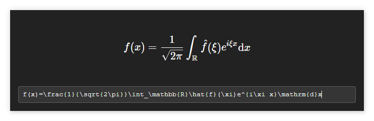

# TeXPaste
Live TeX rendering. Made with [Electron](https://www.electronjs.org/) and [KaTeX](https://katex.org/).

## Upcoming features
Copying the result into the clipboard as an image. This image may be pasted in another application. Also, settings such as colors and custom TeX macros will be available.
